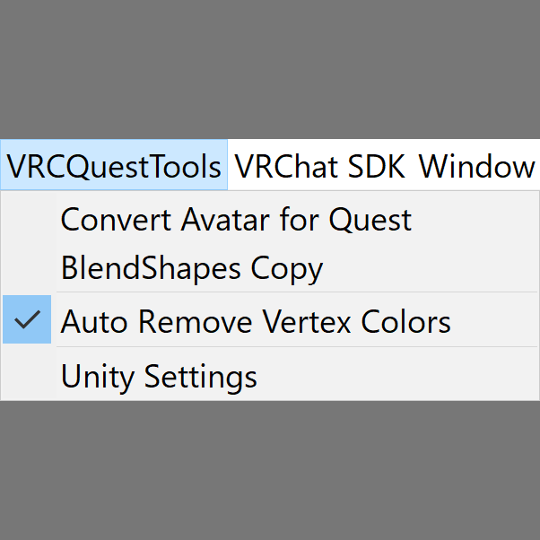

  

  

  
  
  

  

## Install

Choose an install method you like.

### VRChat Creator Companion (VCC)
Click [here](https://kurotu.github.io/vpm-repos/vpm.html) to add the repository to VCC. Then you can install the package in VCC.

### Unitypackage
Download the latest `.unitypackage` from [the release page](https://github.com/kurotu/VRCQuestTools/releases/latest) or [Booth](https://kurotu.booth.pm/items/2436054). Then import it to your avatar project.

### Unity Package Manager (UPM)
Import `https://github.com/kurotu/VRCQuestTools.git`.

## Usage

Select your avatar from a scene, then use *VRCQuestTools* menu item from the menu bar.

## Features

### Convert Avatar for Quest

Convert a PC avatar to be ready to upload for Quest by automating following operations.
VRCQuestTools doesn't make any changes to the original avatar, so you can use the tool in existing projects as is.

- Duplicate the avatar and its materials.
- Change duplicated materials' shader to *VRChat/Mobile/Toon Lit*.
- Generate new textures which applies color and emission of original materials.
- Remove prohibited components such as Dynamic Bone.
- (Avatars 3.0 only) Convert animator controllers and animation clips when the avatar has animation clips which change materials.

⚠ The tool never optimize performance rank. In many cases, the converted avatar would have **Very Poor** for Quest and require *Show Avatar* operation.
See [Quest Limits](https://docs.vrchat.com/docs/avatar-performance-ranking-system#quest-limits) for details.

### Remove Missing Components

Remove "Missing" components from a GameObject and its descendants.
You will often need to use this when Dynamic Bone asset is missing in your project.

### Tools/Remove Unsupported Components

Remove prohibited components such as Dynamic Bone.

### Tools/BlendShapes Copy

Copy BlendShape (Shape key) weights from a Skinned Mesh Renderer to another Skinned Mesh Renderer.
You will often use when PC version and Quest version use different models and need to have same BlendShape weights.

### Tools/Metallic Smoothness Map

Generate *Metallic Smoothness Map* from a metallic map and/or a smoothness/roughness map.
You can use generated textures in *VRChat/Mobile/Standard Lite* shader.

### Auto Remove Vertex Colors

Automatically remove vertex colors from scene's avatars. By using this, this would fix an issue where main textures are not correctly applied in some avatars.

### Unity Settings for Quest

Enable useful settings of Unity.

### Automated Scene Validation

Shows alerts when a Scene can't upload avatars.

## License

The MIT License.

## Contact

- VRCID: kurotu
- Twitter: [@kurotu](https://twitter.com/kurotu)
- GitHub: [kurotu/VRCQuestTools](https://github.com/kurotu/VRCQuestTools)
